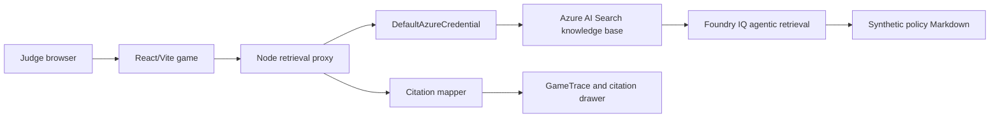

# Phase 7 Submission Readiness

This is the final checklist for submitting Policy Escape Room with live Microsoft
IQ evidence. All game and policy content remains synthetic demo content.

## Live IQ Setup Checklist

- Upload only the Markdown files in
  `data/synthetic-policy-packs/synthetic-cybersecurity-onboarding/foundry-import/`
  to the Foundry IQ knowledge source.
- Confirm the Foundry IQ knowledge base returns references containing section
  markers such as `SYN-POL-005#1.1`.
- Configure `.env.local` or hosted app settings with:
  `FOUNDRY_IQ_SEARCH_ENDPOINT`, `FOUNDRY_IQ_KNOWLEDGE_BASE`,
  `FOUNDRY_IQ_API_VERSION`, and optional `FOUNDRY_IQ_KNOWLEDGE_SOURCE_NAME`.
- Authenticate locally with `az login` or hosted managed identity / app
  settings.
- Run `npm run iq:verify`; it must pass with `retrievalStatus: "foundry_iq"`.
- Run `npm run submission:check` after live IQ verification succeeds.

## Architecture

The browser never receives Azure tokens. The proxy maps Foundry IQ references
back to the app's `EvidenceBundle` and `Citation` shapes before the game shows
citations or trace events.

## Demo Script

1. Start with `npm run dev:foundry` or the hosted app URL.
2. Open the lobby and point out the synthetic/local label.
3. Enter Inbox Vault, open **Trace**, and confirm `foundry_iq`.
4. Open **Sources** and show a citation with `SYN-POL` document and section
   metadata.
5. Submit one wrong answer to show hint and citation behavior.
6. Complete all three rooms and open the final debrief.
7. Open Creator Mode, generate the password/MFA room, and show verifier results.
8. Mention `npm run iq:verify` as the hard live-IQ gate.

## Judging Evidence

| Requirement | Evidence |
|---|---|
| Creative Apps experience | Playable browser policy escape room with scenes, puzzles, hints, citations, and debrief. |
| Microsoft IQ integration | Live Foundry IQ retrieval through server-side Azure AI Search knowledge base retrieve APIs. |
| Grounded answers | Every room, hint, debrief, and generated export path carries citation metadata. |
| Copilot / MCP angle | Local MCP tools expose room generation, puzzle creation, answer validation, citation explanation, and exports. |
| Safety | Synthetic-only policy pack, local scanner, citation validator, verifier, and no committed credentials. |
| Evaluation | `npm run eval:run`, `npm run safety:scan`, and scenario tests documented in the evaluation report. |

## Screenshot And Video Checklist

- Lobby first screen with synthetic/local labeling.
- Trace panel after retrieval showing `foundry_iq`.
- Sources drawer showing `SYN-POL-005#1.1` or another mapped synthetic policy
  section.
- Wrong-answer hint with citation metadata.
- Final debrief with citations.
- Creator Mode generated room verifier result.
- Terminal output from `npm run iq:verify`.
- Hosted URL in browser address bar after deployment.

## Hosted Proof Checklist

- Deploy the Vite app and Node retrieval proxy together on Azure App Service.
- Set hosted app settings for Foundry IQ and Azure auth without committing them.
- Set `VITE_RETRIEVAL_MODE=foundry_iq` and
  `VITE_RETRIEVAL_API_URL=/api/retrieve-policy-evidence` for the hosted build.
- Open the hosted URL, complete one retrieval, and confirm Trace shows
  `foundry_iq`.
- Record the hosted URL, screenshot set, and short demo video before submission.

## Limitations

- `local_mock` fallback is intentionally retained so the app remains playable
  during outages, but fallback does not satisfy the Microsoft IQ requirement.
- This is a hackathon learning demo using synthetic demo content, not a formal
  compliance product.
- Live proof depends on the configured Foundry IQ knowledge base and Azure auth
  at demo time.
